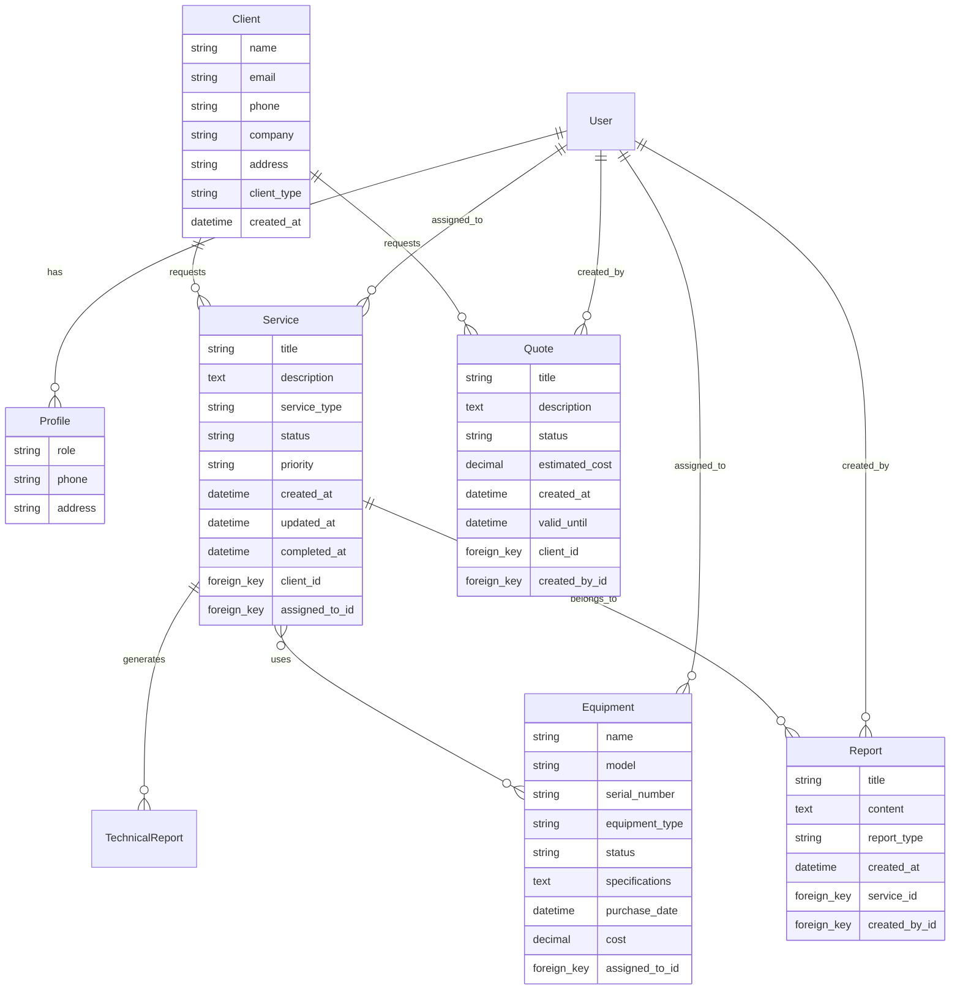

# Arquitectura de Base de Datos - Personal Technology

## 📋 Visión General

La base de datos de Personal Technology está diseñada siguiendo el modelo relacional, utilizando PostgreSQL en producción y SQLite en desarrollo. La arquitectura soporta operaciones CRUD completas para clientes, servicios técnicos, reportes, inventario y cotizaciones.

## 🗂️ Diagrama Entidad-Relación (ER)



## 📊 Esquema de Base de Datos

### Tabla: accounts_profile
```sql
CREATE TABLE accounts_profile (
    id SERIAL PRIMARY KEY,
    user_id INTEGER UNIQUE REFERENCES auth_user(id) ON DELETE CASCADE,
    role VARCHAR(20) NOT NULL DEFAULT 'client',
    phone VARCHAR(20),
    address TEXT,
    created_at TIMESTAMP WITH TIME ZONE DEFAULT CURRENT_TIMESTAMP,
    updated_at TIMESTAMP WITH TIME ZONE DEFAULT CURRENT_TIMESTAMP
);
```

### Tabla: services_client
```sql
CREATE TABLE services_client (
    id SERIAL PRIMARY KEY,
    name VARCHAR(100) NOT NULL,
    email VARCHAR(254) NOT NULL,
    phone VARCHAR(20),
    company VARCHAR(100),
    address TEXT,
    client_type VARCHAR(20) NOT NULL DEFAULT 'service',
    created_at TIMESTAMP WITH TIME ZONE DEFAULT CURRENT_TIMESTAMP,
    updated_at TIMESTAMP WITH TIME ZONE DEFAULT CURRENT_TIMESTAMP
);
```

### Tabla: services_service
```sql
CREATE TABLE services_service (
    id SERIAL PRIMARY KEY,
    title VARCHAR(200) NOT NULL,
    description TEXT,
    service_type VARCHAR(50) NOT NULL,
    status VARCHAR(20) NOT NULL DEFAULT 'pending',
    priority VARCHAR(20) NOT NULL DEFAULT 'medium',
    created_at TIMESTAMP WITH TIME ZONE DEFAULT CURRENT_TIMESTAMP,
    updated_at TIMESTAMP WITH TIME ZONE DEFAULT CURRENT_TIMESTAMP,
    completed_at TIMESTAMP WITH TIME ZONE NULL,
    client_id INTEGER REFERENCES services_client(id) ON DELETE CASCADE,
    assigned_to_id INTEGER REFERENCES auth_user(id) ON DELETE SET NULL
);
```

### Tabla: services_technicalreport
```sql
CREATE TABLE services_technicalreport (
    id SERIAL PRIMARY KEY,
    title VARCHAR(200) NOT NULL,
    diagnosis TEXT,
    solution TEXT,
    recommendations TEXT,
    status VARCHAR(20) NOT NULL DEFAULT 'draft',
    created_at TIMESTAMP WITH TIME ZONE DEFAULT CURRENT_TIMESTAMP,
    updated_at TIMESTAMP WITH TIME ZONE DEFAULT CURRENT_TIMESTAMP,
    service_id INTEGER REFERENCES services_service(id) ON DELETE CASCADE,
    technician_id INTEGER REFERENCES auth_user(id) ON DELETE SET NULL
);
```

### Tabla: inventory_equipment
```sql
CREATE TABLE inventory_equipment (
    id SERIAL PRIMARY KEY,
    name VARCHAR(100) NOT NULL,
    model VARCHAR(100),
    serial_number VARCHAR(100) UNIQUE,
    equipment_type VARCHAR(50) NOT NULL,
    status VARCHAR(20) NOT NULL DEFAULT 'available',
    specifications TEXT,
    purchase_date DATE,
    cost DECIMAL(10,2),
    assigned_to_id INTEGER REFERENCES auth_user(id) ON DELETE SET NULL,
    created_at TIMESTAMP WITH TIME ZONE DEFAULT CURRENT_TIMESTAMP,
    updated_at TIMESTAMP WITH TIME ZONE DEFAULT CURRENT_TIMESTAMP
);
```

### Tabla: quotes_quote
```sql
CREATE TABLE quotes_quote (
    id SERIAL PRIMARY KEY,
    title VARCHAR(200) NOT NULL,
    description TEXT,
    status VARCHAR(20) NOT NULL DEFAULT 'draft',
    estimated_cost DECIMAL(12,2),
    created_at TIMESTAMP WITH TIME ZONE DEFAULT CURRENT_TIMESTAMP,
    valid_until DATE,
    client_id INTEGER REFERENCES services_client(id) ON DELETE CASCADE,
    created_by_id INTEGER REFERENCES auth_user(id) ON DELETE SET NULL
);
```

### Tabla: reports_report
```sql
CREATE TABLE reports_report (
    id SERIAL PRIMARY KEY,
    title VARCHAR(200) NOT NULL,
    content TEXT,
    report_type VARCHAR(50) NOT NULL,
    created_at TIMESTAMP WITH TIME ZONE DEFAULT CURRENT_TIMESTAMP,
    service_id INTEGER REFERENCES services_service(id) ON DELETE CASCADE,
    created_by_id INTEGER REFERENCES auth_user(id) ON DELETE SET NULL
);
```

### Tabla Relacional: services_service_equipment
```sql
CREATE TABLE services_service_equipment (
    id SERIAL PRIMARY KEY,
    service_id INTEGER REFERENCES services_service(id) ON DELETE CASCADE,
    equipment_id INTEGER REFERENCES inventory_equipment(id) ON DELETE CASCADE,
    assigned_at TIMESTAMP WITH TIME ZONE DEFAULT CURRENT_TIMESTAMP,
    returned_at TIMESTAMP WITH TIME ZONE NULL,
    UNIQUE(service_id, equipment_id)
);
```

## 🔗 Relaciones y Cardinalidades

### Relaciones Principales
1. **User ↔ Profile** (1:1)
   - Un usuario tiene exactamente un perfil
   - Un perfil pertenece a exactamente un usuario

2. **Client → Service** (1:N)
   - Un cliente puede tener múltiples servicios
   - Un servicio pertenece a exactamente un cliente

3. **Service → TechnicalReport** (1:N)
   - Un servicio puede tener múltiples reportes técnicos
   - Un reporte técnico pertenece a exactamente un servicio

4. **Service ↔ Equipment** (N:M)
   - Un servicio puede usar múltiples equipos
   - Un equipo puede ser usado en múltiples servicios

5. **User → Service** (1:N, asignación)
   - Un técnico puede estar asignado a múltiples servicios
   - Un servicio tiene asignado a lo sumo un técnico

## 📈 Índices y Optimizaciones

### Índices Recomendados
```sql
-- Índices para búsquedas frecuentes
CREATE INDEX idx_services_client_email ON services_client(email);
CREATE INDEX idx_services_client_company ON services_client(company);
CREATE INDEX idx_services_service_status ON services_service(status);
CREATE INDEX idx_services_service_client_id ON services_service(client_id);
CREATE INDEX idx_services_service_assigned_to ON services_service(assigned_to_id);
CREATE INDEX idx_inventory_equipment_status ON inventory_equipment(status);
CREATE INDEX idx_inventory_equipment_type ON inventory_equipment(equipment_type);

-- Índices compuestos para consultas complejas
CREATE INDEX idx_services_service_status_priority ON services_service(status, priority);
CREATE INDEX idx_services_service_created_at_status ON services_service(created_at, status);
```

## 🔒 Restricciones de Integridad

### Constraints Implementados
```sql
-- Restricciones de dominio
ALTER TABLE accounts_profile ADD CONSTRAINT chk_role
    CHECK (role IN ('admin', 'technician', 'client'));

ALTER TABLE services_client ADD CONSTRAINT chk_client_type
    CHECK (client_type IN ('contract', 'service'));

ALTER TABLE services_service ADD CONSTRAINT chk_service_status
    CHECK (status IN ('pending', 'in_progress', 'completed', 'cancelled'));

ALTER TABLE services_service ADD CONSTRAINT chk_priority
    CHECK (priority IN ('low', 'medium', 'high', 'urgent'));

ALTER TABLE inventory_equipment ADD CONSTRAINT chk_equipment_status
    CHECK (status IN ('available', 'assigned', 'maintenance', 'retired'));

-- Restricciones de unicidad
ALTER TABLE services_client ADD CONSTRAINT unique_client_email UNIQUE (email);
ALTER TABLE inventory_equipment ADD CONSTRAINT unique_serial_number UNIQUE (serial_number);
```

## 📊 Consultas Optimizadas

### Consultas Frecuentes
```sql
-- Servicios activos por cliente
SELECT c.name, COUNT(s.id) as active_services
FROM services_client c
LEFT JOIN services_service s ON c.id = s.client_id
WHERE s.status IN ('pending', 'in_progress')
GROUP BY c.id, c.name;

-- Reporte de servicios por técnico
SELECT u.username, COUNT(s.id) as assigned_services,
       AVG(EXTRACT(EPOCH FROM (s.completed_at - s.created_at))/3600) as avg_completion_hours
FROM auth_user u
LEFT JOIN services_service s ON u.id = s.assigned_to_id
WHERE s.status = 'completed'
GROUP BY u.id, u.username;

-- Inventario por tipo y estado
SELECT equipment_type, status, COUNT(*) as count
FROM inventory_equipment
GROUP BY equipment_type, status
ORDER BY equipment_type, status;
```

## 🔄 Migraciones Django

### Estrategia de Migraciones
- **Versionado**: Cada cambio en modelos genera una migración
- **Rollback**: Capacidad de revertir cambios
- **Data Migrations**: Para migrar datos existentes
- **Dependencies**: Control de dependencias entre migraciones

### Ejemplo de Migración
```python
# 0001_initial.py
from django.db import migrations, models
import django.db.models.deletion

class Migration(migrations.Migration):
    initial = True
    dependencies = [
        ('auth', '0012_alter_user_first_name_max_length'),
    ]

    operations = [
        migrations.CreateModel(
            name='Profile',
            fields=[
                ('id', models.AutoField(primary_key=True)),
                ('role', models.CharField(default='client', max_length=20)),
                ('phone', models.CharField(blank=True, max_length=20, null=True)),
                ('address', models.TextField(blank=True, null=True)),
                ('user', models.OneToOneField(on_delete=django.db.models.deletion.CASCADE, to='auth.user')),
            ],
        ),
    ]
```

## 📈 Estrategias de Escalabilidad

### Particionamiento
- **Por tiempo**: Servicios por mes/año
- **Por cliente**: Datos de clientes grandes
- **Por región**: Si se expande geográficamente

### Replicación
- **Read Replicas**: Para consultas de solo lectura
- **Master-Slave**: Para alta disponibilidad
- **Multi-Master**: Para escrituras distribuidas

### Optimizaciones de Performance
- **Connection Pooling**: PgBouncer para PostgreSQL
- **Query Optimization**: EXPLAIN ANALYZE para consultas lentas
- **Caching**: Redis para sesiones y consultas frecuentes
- **Database Sharding**: Particionamiento horizontal si crece mucho

## 🔧 Mantenimiento

### Tareas de Mantenimiento
- **VACUUM**: Liberar espacio en PostgreSQL
- **REINDEX**: Reconstruir índices degradados
- **ANALYZE**: Actualizar estadísticas del optimizador
- **Backup**: Estrategia diaria de respaldos

### Monitoreo
- **Query Performance**: Identificar consultas lentas
- **Connection Count**: Monitorear conexiones activas
- **Disk Usage**: Espacio utilizado por tablas
- **Index Usage**: Eficiencia de índices

## 📝 Conclusiones

Esta arquitectura de base de datos proporciona:
- ✅ **Integridad**: Restricciones y relaciones consistentes
- ✅ **Performance**: Índices optimizados y consultas eficientes
- ✅ **Escalabilidad**: Diseño preparado para crecimiento
- ✅ **Mantenibilidad**: Migraciones versionadas y documentadas
- ✅ **Seguridad**: Control de acceso y auditoría

La base de datos está diseñada para manejar el crecimiento esperado de Personal Technology, desde una pequeña empresa hasta una operación de mediano tamaño, manteniendo la integridad de los datos y el rendimiento óptimo.