# Arquitectura de Frontend - Personal Technology

## 📋 Visión General

El frontend de Personal Technology está construido con Bootstrap 5, proporcionando una interfaz moderna, responsive y accesible. La arquitectura sigue principios de diseño atómico y componentes reutilizables.

## 🎨 Sistema de Diseño

### Paleta de Colores
```css
:root {
  /* Colores primarios */
  --primary-color: #0d6efd;
  --secondary-color: #6c757d;
  --success-color: #198754;
  --danger-color: #dc3545;
  --warning-color: #ffc107;
  --info-color: #0dcaf0;

  /* Colores neutros */
  --light-color: #f8f9fa;
  --dark-color: #212529;
  --white: #ffffff;

  /* Tema oscuro */
  --dark-bg: #1a1a1a;
  --dark-surface: #2d2d2d;
  --dark-text: #e0e0e0;
}
```

### Tipografía
- **Fuente principal**: Inter (Google Fonts)
- **Fuente secundaria**: Sistema sans-serif
- **Jerarquía**:
  - H1: 2.5rem (40px)
  - H2: 2rem (32px)
  - H3: 1.75rem (28px)
  - H4: 1.5rem (24px)
  - Body: 1rem (16px)
  - Small: 0.875rem (14px)

### Espaciado
```css
/* Sistema de espaciado basado en 0.25rem (4px) */
--spacing-xs: 0.25rem;   /* 4px */
--spacing-sm: 0.5rem;    /* 8px */
--spacing-md: 1rem;      /* 16px */
--spacing-lg: 1.5rem;    /* 24px */
--spacing-xl: 2rem;      /* 32px */
--spacing-xxl: 3rem;     /* 48px */
```

## 🏗️ Arquitectura de Componentes

### Patrón de Diseño Atómico

```mermaid
graph TD
    A[Átomos] --> B[Moléculas]
    B --> C[Organismos]
    C --> D[Templates]
    D --> E[Páginas]

    A1[Botones] --> B1[Formularios]
    A2[Inputs] --> B1
    A3[Labels] --> B1

    B1 --> C1[Navbar]
    B2[Cards] --> C1
    B3[Modales] --> C2[Dashboard]

    C1 --> D1[Base Template]
    C2 --> D1

    D1 --> E1[Home Page]
    D1 --> E2[Client List]
```


### Componentes Principales

#### 1. Navbar Responsive
```html
<nav class="navbar navbar-expand-lg navbar-dark bg-primary shadow">
  <div class="container-fluid">
    <a class="navbar-brand d-flex align-items-center" href="#">
      
      <span class="fw-bold">Personal Technology</span>
    </a>

    <button class="navbar-toggler" type="button" data-bs-toggle="offcanvas" data-bs-target="#navbarNav">
      <span class="navbar-toggler-icon"></span>
    </button>

    <div class="offcanvas offcanvas-end" id="navbarNav">
      <div class="offcanvas-header">
        <h5 class="offcanvas-title">Menú</h5>
        <button type="button" class="btn-close" data-bs-dismiss="offcanvas"></button>
      </div>
      <div class="offcanvas-body">
        <ul class="navbar-nav me-auto">
          <li class="nav-item">
            <a class="nav-link" href="">Inicio</a>
          </li>
          
          <li class="nav-item dropdown">
            <a class="nav-link dropdown-toggle" href="#" role="button" data-bs-toggle="dropdown">
              Servicios
            </a>
            <ul class="dropdown-menu">
              <li><a class="dropdown-item" href="">Clientes</a></li>
              <li><a class="dropdown-item" href="">Servicios</a></li>
              <li><a class="dropdown-item" href="">Reportes</a></li>
            </ul>
          </li>
          
        </ul>

        <ul class="navbar-nav">
          
          <li class="nav-item dropdown">
            <a class="nav-link dropdown-toggle" href="#" data-bs-toggle="dropdown">
              <i class="bi bi-person-circle me-1"></i>{{ user.get_full_name|default:user.username }}
            </a>
            <ul class="dropdown-menu">
              <li><a class="dropdown-item" href="">Perfil</a></li>
              <li><hr class="dropdown-divider"></li>
              <li><a class="dropdown-item" href="">Cerrar Sesión</a></li>
            </ul>
          </li>
          
          <li class="nav-item">
            <a class="btn btn-outline-light ms-2" href="">Iniciar Sesión</a>
          </li>
          
        </ul>
      </div>
    </div>
  </div>
</nav>
```

#### 2. Selector de Tema
```html
<div class="theme-selector position-fixed" style="top: 20px; right: 20px; z-index: 1050;">
  <button class="btn btn-sm btn-outline-secondary theme-toggle" id="themeToggle">
    <i class="bi bi-sun-fill" id="themeIcon"></i>
  </button>
</div>
```

```javascript
// theme-selector.js
document.addEventListener('DOMContentLoaded', function() {
  const themeToggle = document.getElementById('themeToggle');
  const themeIcon = document.getElementById('themeIcon');
  const html = document.documentElement;

  // Cargar tema guardado
  const savedTheme = localStorage.getItem('theme') || 'light';
  html.setAttribute('data-bs-theme', savedTheme);
  updateThemeIcon(savedTheme);

  themeToggle.addEventListener('click', function() {
    const currentTheme = html.getAttribute('data-bs-theme');
    const newTheme = currentTheme === 'light' ? 'dark' : 'light';

    html.setAttribute('data-bs-theme', newTheme);
    localStorage.setItem('theme', newTheme);
    updateThemeIcon(newTheme);
  });

  function updateThemeIcon(theme) {
    themeIcon.className = theme === 'light' ? 'bi bi-moon-stars-fill' : 'bi bi-sun-fill';
  }
});
```

#### 3. Tablas de Datos con Paginación
```html
<div class="card">
  <div class="card-header d-flex justify-content-between align-items-center">
    <h5 class="mb-0">Lista de Clientes</h5>
    <a href="" class="btn btn-primary btn-sm">
      <i class="bi bi-plus-circle me-1"></i>Agregar Cliente
    </a>
  </div>
  <div class="card-body">
    <div class="table-responsive">
      <table class="table table-hover">
        <thead class="table-light">
          <tr>
            <th>Nombre</th>
            <th>Email</th>
            <th>Empresa</th>
            <th>Tipo</th>
            <th>Acciones</th>
          </tr>
        </thead>
        <tbody>
          
          <tr>
            <td>{{ client.name }}</td>
            <td>{{ client.email }}</td>
            <td>{{ client.company|default:"N/A" }}</td>
            <td>
              <span class="badge bg-{{ client.client_type|lower == 'contract' and 'success' or 'info' }}">
                {{ client.get_client_type_display }}
              </span>
            </td>
            <td>
              <div class="btn-group" role="group">
                <a href="" class="btn btn-sm btn-outline-primary">
                  <i class="bi bi-eye"></i>
                </a>
                <a href="" class="btn btn-sm btn-outline-secondary">
                  <i class="bi bi-pencil"></i>
                </a>
                <a href="" class="btn btn-sm btn-outline-danger">
                  <i class="bi bi-trash"></i>
                </a>
              </div>
            </td>
          </tr>
          
          <tr>
            <td colspan="5" class="text-center text-muted py-4">
              <i class="bi bi-inbox fs-1 d-block mb-2"></i>
              No hay clientes registrados
            </td>
          </tr>
          
        </tbody>
      </table>
    </div>

    
    <nav aria-label="Paginación de clientes">
      <ul class="pagination justify-content-center">
        
        <li class="page-item">
          <a class="page-link" href="?page={{ page_obj.previous_page_number }}">Anterior</a>
        </li>
        

        
        <li class="page-item active">
          <a class="page-link" href="?page={{ num }}">{{ num }}</a>
        </li>
        

        
        <li class="page-item">
          <a class="page-link" href="?page={{ page_obj.next_page_number }}">Siguiente</a>
        </li>
        
      </ul>
    </nav>
    
  </div>
</div>
```

#### 4. Formularios con Validación
```html
<form method="post" novalidate>
  

  <div class="row g-3">
    
    <div class="col-md-{{ field.name == 'description' and '12' or '6' }}">
      <label for="{{ field.id_for_label }}" class="form-label">
        {{ field.label }}
        <span class="text-danger">*</span>
      </label>

      <div class="input-group">
        
        <span class="input-group-text"><i class="bi bi-envelope"></i></span>
        
        <span class="input-group-text"><i class="bi bi-telephone"></i></span>
        

        {{ field }}
      </div>

      
      <div class="invalid-feedback d-block">
        
        <span>{{ error }}</span>
        
      </div>
      

      
      <div class="form-text">{{ field.help_text }}</div>
      
    </div>
    
  </div>

  <div class="d-flex gap-2 mt-4">
    <button type="submit" class="btn btn-primary">
      <i class="bi bi-check-circle me-1"></i>Guardar
    </button>
    <a href="" class="btn btn-secondary">
      <i class="bi bi-arrow-left me-1"></i>Cancelar
    </a>
  </div>
</form>
```

## 📱 Diseño Responsive

### Breakpoints de Bootstrap 5
```css
/* Extra small devices (phones, <576px) */
@media (max-width: 575.98px) { ... }

/* Small devices (tablets, ≥576px) */
@media (min-width: 576px) { ... }

/* Medium devices (desktops, ≥768px) */
@media (min-width: 768px) { ... }

/* Large devices (desktops, ≥992px) */
@media (min-width: 992px) { ... }

/* Extra large devices (large desktops, ≥1200px) */
@media (min-width: 1200px) { ... }

/* Extra extra large devices (larger desktops, ≥1400px) */
@media (min-width: 1400px) { ... }
```

### Grid System Adaptativo
```html
<div class="container-fluid">
  <div class="row">
    <!-- Sidebar - oculto en móvil, visible en desktop -->
    <div class="col-lg-3 d-none d-lg-block">
      <div class="sidebar">...</div>
    </div>

    <!-- Contenido principal -->
    <div class="col-12 col-lg-9">
      <div class="main-content">
        <!-- Header adaptable -->
        <div class="row mb-4">
          <div class="col-12 col-md-8">
            <h1 class="h3 mb-0">Dashboard</h1>
          </div>
          <div class="col-12 col-md-4 text-md-end">
            <button class="btn btn-primary w-100 w-md-auto">
              Nueva Acción
            </button>
          </div>
        </div>

        <!-- Cards responsive -->
        <div class="row g-3">
          <div class="col-12 col-sm-6 col-xl-3">
            <div class="card">...</div>
          </div>
          <div class="col-12 col-sm-6 col-xl-3">
            <div class="card">...</div>
          </div>
        </div>
      </div>
    </div>
  </div>
</div>
```

## 🎯 Experiencia de Usuario (UX)

### Principios de Diseño
1. **Claridad**: Interfaz intuitiva y fácil de entender
2. **Consistencia**: Elementos y patrones uniformes
3. **Eficiencia**: Minimizar clics y tiempo de tarea
4. **Accesibilidad**: Cumplir estándares WCAG 2.1

### Flujo de Usuario Típico

```mermaid
sequenceDiagram
    participant U as Usuario
    participant F as Frontend
    participant B as Backend
    participant D as Base de Datos

    U->>F: Accede a la aplicación
    F->>B: Verifica autenticación
    B->>D: Consulta permisos
    D-->>B: Retorna rol de usuario
    B-->>F: Renderiza interfaz según rol

    U->>F: Solicita lista de clientes
    F->>B: Petición AJAX/GET
    B->>D: Consulta clientes con filtros
    D-->>B: Retorna datos paginados
    B-->>F: Renderiza tabla con datos

    U->>F: Crea nuevo cliente
    F->>F: Validación frontend
    F->>B: POST con datos del formulario
    B->>B: Validación backend
    B->>D: Inserta nuevo registro
    D-->>B: Confirma inserción
    B-->>F: Redirección con mensaje de éxito
```


## ♿ Accesibilidad

### Atributos ARIA
```html
<!-- Navegación accesible -->
<nav aria-label="Navegación principal">
  <ul class="navbar-nav">
    <li class="nav-item">
      <a class="nav-link" href="#main-content" aria-label="Ir al contenido principal">
        Saltar navegación
      </a>
    </li>
  </ul>
</nav>

<!-- Formularios accesibles -->
<form role="form" aria-labelledby="form-title">
  <h2 id="form-title">Crear Nuevo Cliente</h2>

  <div class="mb-3">
    <label for="id_name" class="form-label">Nombre completo</label>
    <input type="text" id="id_name" name="name" class="form-control"
           aria-describedby="name-help" aria-required="true">
    <div id="name-help" class="form-text">
      Ingrese el nombre completo del cliente
    </div>
  </div>
</form>

<!-- Tablas accesibles -->
<table class="table" role="table" aria-label="Lista de clientes">
  <thead>
    <tr role="row">
      <th role="columnheader" scope="col">Nombre</th>
      <th role="columnheader" scope="col">Email</th>
      <th role="columnheader" scope="col">Acciones</th>
    </tr>
  </thead>
  <tbody>
    <tr role="row">
      <td role="cell">Juan Pérez</td>
      <td role="cell">juan@email.com</td>
      <td role="cell">
        <button aria-label="Editar cliente Juan Pérez">
          <i class="bi bi-pencil"></i>
        </button>
      </td>
    </tr>
  </tbody>
</table>
```

### Navegación por Teclado
```javascript
// keyboard-navigation.js
document.addEventListener('keydown', function(e) {
  // Alt + H: Ir al inicio
  if (e.altKey && e.key === 'h') {
    e.preventDefault();
    window.location.href = '/';
  }

  // Alt + C: Ir a clientes
  if (e.altKey && e.key === 'c') {
    e.preventDefault();
    window.location.href = '/clients/';
  }

  // Escape: Cerrar modales
  if (e.key === 'Escape') {
    const modals = document.querySelectorAll('.modal.show');
    modals.forEach(modal => {
      const bsModal = bootstrap.Modal.getInstance(modal);
      if (bsModal) bsModal.hide();
    });
  }
});
```

## 🎨 Animaciones y Transiciones

### CSS Transitions
```css
/* Transiciones suaves */
.btn {
  transition: all 0.3s ease;
}

.btn:hover {
  transform: translateY(-2px);
  box-shadow: 0 4px 8px rgba(0,0,0,0.1);
}

/* Animaciones de carga */
.loading-spinner {
  animation: spin 1s linear infinite;
}

@keyframes spin {
  0% { transform: rotate(0deg); }
  100% { transform: rotate(360deg); }
}

/* Transiciones de página */
.page-transition {
  opacity: 0;
  animation: fadeIn 0.5s ease forwards;
}

@keyframes fadeIn {
  to {
    opacity: 1;
  }
}
```

### JavaScript Animations
```javascript
// Animaciones con Intersection Observer
const observerOptions = {
  threshold: 0.1,
  rootMargin: '0px 0px -50px 0px'
};

const observer = new IntersectionObserver((entries) => {
  entries.forEach(entry => {
    if (entry.isIntersecting) {
      entry.target.classList.add('animate-in');
    }
  });
}, observerOptions);

// Observar elementos para animar
document.querySelectorAll('.card').forEach(card => {
  observer.observe(card);
});
```

## 📊 Dashboard Interactivo

### Gráficos con Chart.js
```html
<div class="row">
  <div class="col-md-6">
    <div class="card">
      <div class="card-header">
        <h5>Servicios por Estado</h5>
      </div>
      <div class="card-body">
        <canvas id="servicesChart" width="400" height="200"></canvas>
      </div>
    </div>
  </div>
</div>
```

```javascript
// dashboard-charts.js
document.addEventListener('DOMContentLoaded', function() {
  const ctx = document.getElementById('servicesChart').getContext('2d');

  new Chart(ctx, {
    type: 'doughnut',
    data: {
      labels: ['Pendientes', 'En Progreso', 'Completados', 'Cancelados'],
      datasets: [{
        data: [12, 8, 25, 3],
        backgroundColor: [
          '#ffc107', // warning
          '#0dcaf0', // info
          '#198754', // success
          '#dc3545'  // danger
        ],
        borderWidth: 2
      }]
    },
    options: {
      responsive: true,
      plugins: {
        legend: {
          position: 'bottom'
        }
      }
    }
  });
});
```

## 🔧 Optimización de Performance

### Lazy Loading de Imágenes
```html

```

### Minificación y Compresión
```python
# settings.py - configuración para archivos estáticos
STATICFILES_STORAGE = 'django.contrib.staticfiles.storage.ManifestStaticFilesStorage'

# Middleware para compresión
MIDDLEWARE = [
    'django.middleware.gzip.GZipMiddleware',
    # ... otros middlewares
]
```

### Caching Estratégico
```python
# Caching de vistas
from django.views.decorators.cache import cache_page

@cache_page(60 * 15)  # Cache por 15 minutos
def client_list(request):
    # ... lógica de la vista
```

## 📱 Progressive Web App (PWA)

### Manifest.json
```json
{
  "name": "Personal Technology",
  "short_name": "PT",
  "description": "Sistema de Gestión de Servicios TI",
  "start_url": "/",
  "display": "standalone",
  "background_color": "#ffffff",
  "theme_color": "#0d6efd",
  "icons": [
    {
      "src": "/static/icon-192.png",
      "sizes": "192x192",
      "type": "image/png"
    },
    {
      "src": "/static/icon-512.png",
      "sizes": "512x512",
      "type": "image/png"
    }
  ]
}
```

### Service Worker
```javascript
// sw.js
self.addEventListener('install', event => {
  event.waitUntil(
    caches.open('personal-tech-v1').then(cache => {
      return cache.addAll([
        '/',
        '/static/css/bootstrap.min.css',
        '/static/js/bootstrap.bundle.min.js',
        '/static/icono_tras.png'
      ]);
    })
  );
});

self.addEventListener('fetch', event => {
  event.respondWith(
    caches.match(event.request).then(response => {
      return response || fetch(event.request);
    })
  );
});
```

## 📝 Conclusiones

Esta arquitectura de frontend proporciona:
- ✅ **Responsive**: Funciona en todos los dispositivos
- ✅ **Accesible**: Cumple estándares de accesibilidad
- ✅ **Performante**: Optimizaciones implementadas
- ✅ **Mantenible**: Componentes reutilizables
- ✅ **Moderno**: Tecnologías actualizadas

El frontend está diseñado para ofrecer una experiencia excepcional al usuario, manteniendo la simplicidad y eficiencia en el desarrollo y mantenimiento.