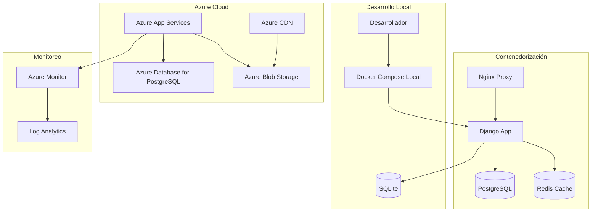

# Arquitectura de Infraestructura - Personal Technology

## 📋 Visión General

La infraestructura de Personal Technology está diseñada para ser escalable, segura y de bajo costo operativo. Utiliza contenedorización con Docker y despliegue en la nube con Azure, permitiendo desarrollo local consistente y producción robusta.

## 🏗️ Arquitectura General



## 🐳 Dockerización

### Dockerfile para Django
```dockerfile
# Dockerfile
FROM python:3.11-slim

# Configuración del entorno
ENV PYTHONDONTWRITEBYTECODE=1
ENV PYTHONUNBUFFERED=1

# Directorio de trabajo
WORKDIR /app

# Instalar dependencias del sistema
RUN apt-get update \
    && apt-get install -y --no-install-recommends \
        gcc \
        postgresql-client \
        libpq-dev \
    && rm -rf /var/lib/apt/lists/*

# Instalar dependencias de Python
COPY requirements.txt .
RUN pip install --no-cache-dir -r requirements.txt

# Copiar código de la aplicación
COPY . .

# Crear usuario no-root
RUN useradd --create-home --shell /bin/bash app \
    && chown -R app:app /app
USER app

# Puerto de exposición
EXPOSE 8000

# Comando de ejecución
CMD ["gunicorn", "--bind", "0.0.0.0:8000", "--workers", "3", "personal_tech.wsgi:application"]
```

### Dockerfile para Nginx
```dockerfile
# Dockerfile.nginx
FROM nginx:alpine

# Copiar configuración de Nginx
COPY nginx.conf /etc/nginx/nginx.conf

# Copiar archivos estáticos
COPY --from=django /app/staticfiles /usr/share/nginx/html/static

# Puerto de exposición
EXPOSE 80

# Comando de ejecución
CMD ["nginx", "-g", "daemon off;"]
```

### Docker Compose
```yaml
# docker-compose.yml
version: '3.8'

services:
  db:
    image: postgres:15
    environment:
      POSTGRES_DB: personal_tech
      POSTGRES_USER: postgres
      POSTGRES_PASSWORD: password
    volumes:
      - postgres_data:/var/lib/postgresql/data
    ports:
      - "5432:5432"
    healthcheck:
      test: ["CMD-SHELL", "pg_isready -U postgres"]
      interval: 30s
      timeout: 10s
      retries: 3

  redis:
    image: redis:7-alpine
    ports:
      - "6379:6379"
    command: redis-server --appendonly yes
    volumes:
      - redis_data:/data

  web:
    build:
      context: .
      dockerfile: Dockerfile
    environment:
      - DEBUG=False
      - DATABASE_URL=postgresql://postgres:password@db:5432/personal_tech
      - REDIS_URL=redis://redis:6379/0
    ports:
      - "8000:8000"
    depends_on:
      db:
        condition: service_healthy
      redis:
        condition: service_started
    volumes:
      - staticfiles:/app/staticfiles
    command: >
      sh -c "python manage.py collectstatic --noinput &&
             python manage.py migrate &&
             gunicorn --bind 0.0.0.0:8000 --workers 3 personal_tech.wsgi:application"

  nginx:
    build:
      context: .
      dockerfile: Dockerfile.nginx
    ports:
      - "80:80"
    depends_on:
      - web
    volumes:
      - staticfiles:/usr/share/nginx/html/static:ro

volumes:
  postgres_data:
  redis_data:
  staticfiles:
```

## ☁️ Despliegue en Azure

### Azure App Services
```json
{
  "name": "personal-tech-web",
  "type": "Microsoft.Web/sites",
  "apiVersion": "2022-03-01",
  "location": "East US",
  "properties": {
    "serverFarmId": "[resourceId('Microsoft.Web/serverfarms', variables('appServicePlanName'))]",
    "httpsOnly": true,
    "siteConfig": {
      "linuxFxVersion": "DOCKER|personaltech.azurecr.io/personal-tech:latest",
      "appSettings": [
        {
          "name": "DOCKER_REGISTRY_SERVER_URL",
          "value": "https://personaltech.azurecr.io"
        },
        {
          "name": "DOCKER_REGISTRY_SERVER_USERNAME",
          "value": "[parameters('registryUsername')]"
        },
        {
          "name": "DOCKER_REGISTRY_SERVER_PASSWORD",
          "value": "[parameters('registryPassword')]"
        },
        {
          "name": "DATABASE_URL",
          "value": "[parameters('databaseUrl')]"
        },
        {
          "name": "SECRET_KEY",
          "value": "[parameters('secretKey')]"
        },
        {
          "name": "DEBUG",
          "value": "False"
        }
      ]
    }
  }
}
```

### Azure Database for PostgreSQL
```json
{
  "name": "personal-tech-db",
  "type": "Microsoft.DBforPostgreSQL/servers",
  "apiVersion": "2022-01-01",
  "location": "East US",
  "sku": {
    "name": "B_Gen5_1",
    "tier": "Basic",
    "capacity": 1,
    "size": "51200",
    "family": "Gen5"
  },
  "properties": {
    "administratorLogin": "[parameters('administratorLogin')]",
    "administratorLoginPassword": "[parameters('administratorLoginPassword')]",
    "version": "15",
    "sslEnforcement": "Enabled",
    "minimalTlsVersion": "TLS1_2",
    "storageProfile": {
      "storageMB": 51200,
      "backupRetentionDays": 7,
      "geoRedundantBackup": "Disabled"
    }
  }
}
```

## 🔄 CI/CD con GitHub Actions

### Workflow de Despliegue
```yaml
# .github/workflows/deploy.yml
name: Deploy to Azure

on:
  push:
    branches: [ main ]
  pull_request:
    branches: [ main ]

env:
  AZURE_WEBAPP_NAME: personal-tech-web
  AZURE_RESOURCE_GROUP: personal-tech-rg

jobs:
  build-and-deploy:
    runs-on: ubuntu-latest

    steps:
    - name: Checkout code
      uses: actions/checkout@v4

    - name: Login to Azure
      uses: azure/login@v1
      with:
        creds: ${{ secrets.AZURE_CREDENTIALS }}

    - name: Login to Container Registry
      uses: azure/docker-login@v1
      with:
        login-server: personaltech.azurecr.io
        username: ${{ secrets.REGISTRY_USERNAME }}
        password: ${{ secrets.REGISTRY_PASSWORD }}

    - name: Build and push Docker image
      run: |
        docker build -t personaltech.azurecr.io/personal-tech:${{ github.sha }} .
        docker push personaltech.azurecr.io/personal-tech:${{ github.sha }}

    - name: Deploy to Azure Web App
      uses: azure/webapps-deploy@v2
      with:
        app-name: ${{ env.AZURE_WEBAPP_NAME }}
        images: personaltech.azurecr.io/personal-tech:${{ github.sha }}

    - name: Run database migrations
      run: |
        az webapp config appsettings set \
          --name ${{ env.AZURE_WEBAPP_NAME }} \
          --resource-group ${{ env.AZURE_RESOURCE_GROUP }} \
          --setting DOCKER_CUSTOM_IMAGE_NAME=personaltech.azurecr.io/personal-tech:${{ github.sha }}

    - name: Health check
      run: |
        sleep 30
        curl -f https://${{ env.AZURE_WEBAPP_NAME }}.azurewebsites.net/health/
```

## 📊 Monitoreo y Logging

### Azure Monitor
```json
{
  "name": "personal-tech-insights",
  "type": "Microsoft.Insights/components",
  "apiVersion": "2020-02-02",
  "location": "East US",
  "properties": {
    "Application_Type": "web",
    "ApplicationId": "[reference(resourceId('Microsoft.Web/sites', variables('webAppName')), '2022-03-01').identity.principalId]"
  }
}
```

### Configuración de Logging en Django
```python
# settings.py
LOGGING = {
    'version': 1,
    'disable_existing_loggers': False,
    'formatters': {
        'verbose': {
            'format': '{levelname} {asctime} {module} {process:d} {thread:d} {message}',
            'style': '{',
        },
        'simple': {
            'format': '{levelname} {message}',
            'style': '{',
        },
    },
    'handlers': {
        'file': {
            'level': 'INFO',
            'class': 'logging.FileHandler',
            'filename': '/app/logs/django.log',
            'formatter': 'verbose',
        },
        'console': {
            'level': 'INFO',
            'class': 'logging.StreamHandler',
            'formatter': 'simple',
        },
    },
    'root': {
        'handlers': ['console', 'file'],
        'level': 'INFO',
    },
    'loggers': {
        'django': {
            'handlers': ['console', 'file'],
            'level': 'INFO',
            'propagate': False,
        },
    },
}
```

## 🔒 Seguridad

### Azure Security Center
- **Network Security**: NSG rules para controlar tráfico
- **Identity Management**: Azure AD integration
- **Key Vault**: Gestión de secrets y certificados
- **DDoS Protection**: Protección contra ataques DDoS

### Configuración SSL/TLS
```nginx
# nginx.conf
server {
    listen 80;
    server_name personal-tech.com www.personal-tech.com;
    return 301 https://$server_name$request_uri;
}

server {
    listen 443 ssl http2;
    server_name personal-tech.com www.personal-tech.com;

    ssl_certificate /etc/ssl/certs/personal_tech.crt;
    ssl_certificate_key /etc/ssl/private/personal_tech.key;
    ssl_protocols TLSv1.2 TLSv1.3;
    ssl_ciphers ECDHE-RSA-AES256-GCM-SHA512:DHE-RSA-AES256-GCM-SHA512:ECDHE-RSA-AES256-GCM-SHA384;

    location / {
        proxy_pass http://web:8000;
        proxy_set_header Host $host;
        proxy_set_header X-Real-IP $remote_addr;
        proxy_set_header X-Forwarded-For $proxy_add_x_forwarded_for;
        proxy_set_header X-Forwarded-Proto $scheme;
    }

    location /static/ {
        alias /usr/share/nginx/html/static/;
        expires 1y;
        add_header Cache-Control "public, immutable";
    }
}
```

## 📈 Escalabilidad

### Auto-scaling en Azure
```json
{
  "name": "webAppScaleSettings",
  "type": "Microsoft.Insights/autoscalesettings",
  "apiVersion": "2022-10-01",
  "properties": {
    "name": "WebAppScaleSettings",
    "targetResourceUri": "[resourceId('Microsoft.Web/sites', variables('webAppName'))]",
    "profiles": [
      {
        "name": "Default",
        "capacity": {
          "minimum": "1",
          "maximum": "10",
          "default": "1"
        },
        "rules": [
          {
            "metricTrigger": {
              "metricName": "CpuPercentage",
              "metricNamespace": "Microsoft.Web/sites",
              "operator": "GreaterThan",
              "statistic": "Average",
              "threshold": 70,
              "timeAggregation": "Average",
              "timeGrain": "PT1M",
              "timeWindow": "PT5M"
            },
            "scaleAction": {
              "direction": "Increase",
              "type": "ChangeCount",
              "value": "1",
              "cooldown": "PT5M"
            }
          }
        ]
      }
    ]
  }
}
```

### Redis para Caching
```python
# settings.py
CACHES = {
    'default': {
        'BACKEND': 'django.core.cache.backends.redis.RedisCache',
        'LOCATION': os.getenv('REDIS_URL', 'redis://127.0.0.1:6379/1'),
    }
}

# Uso en vistas
from django.core.cache import cache

def client_list(request):
    clients = cache.get('clients_list')
    if not clients:
        clients = Client.objects.all()
        cache.set('clients_list', clients, 300)  # Cache por 5 minutos
    return render(request, 'services/client_list.html', {'clients': clients})
```

## 💰 Costos y Optimización

### Estrategia de Costos
- **App Service**: Plan B1 ($13.14/mes) para desarrollo
- **PostgreSQL**: Basic tier ($27.50/mes) para datos moderados
- **Blob Storage**: LRS ($0.0184/GB/mes) para archivos estáticos
- **CDN**: $0.087/GB para distribución global

### Optimizaciones
- **Reserved Instances**: Descuentos por compromiso anual
- **Auto-shutdown**: Detener recursos en horarios no laborales
- **Storage Optimization**: Compresión de archivos estáticos
- **Database Optimization**: Índices y consultas optimizadas

## 🔄 Backup y Disaster Recovery

### Estrategia de Backup
```bash
# Script de backup
#!/bin/bash
DATE=$(date +%Y%m%d_%H%M%S)
BACKUP_DIR="/backups"

# Backup de base de datos
pg_dump -h $DB_HOST -U $DB_USER -d $DB_NAME > $BACKUP_DIR/db_backup_$DATE.sql

# Backup de archivos estáticos
az storage blob download-batch \
  --destination $BACKUP_DIR/files_$DATE \
  --source $STORAGE_CONTAINER \
  --account-name $STORAGE_ACCOUNT

# Subir a Azure Blob Storage
az storage blob upload \
  --file $BACKUP_DIR/db_backup_$DATE.sql \
  --container-name backups \
  --name db_backup_$DATE.sql

# Limpiar backups antiguos (mantener últimos 30 días)
find $BACKUP_DIR -name "db_backup_*.sql" -mtime +30 -delete
```

### Plan de Recuperación
1. **RTO (Recovery Time Objective)**: 4 horas
2. **RPO (Recovery Point Objective)**: 1 hora
3. **Failover**: Azure Traffic Manager para redirección automática
4. **Testing**: Pruebas mensuales de recuperación

## 📝 Conclusiones

Esta arquitectura de infraestructura proporciona:
- ✅ **Escalabilidad**: Auto-scaling basado en demanda
- ✅ **Disponibilidad**: Alta disponibilidad con Azure
- ✅ **Seguridad**: Múltiples capas de protección
- ✅ **Performance**: Caching y optimizaciones implementadas
- ✅ **Costo-efectividad**: Recursos optimizados para presupuesto

La infraestructura está preparada para el crecimiento de Personal Technology, desde una aplicación pequeña hasta una plataforma empresarial, manteniendo la fiabilidad y el rendimiento requeridos.