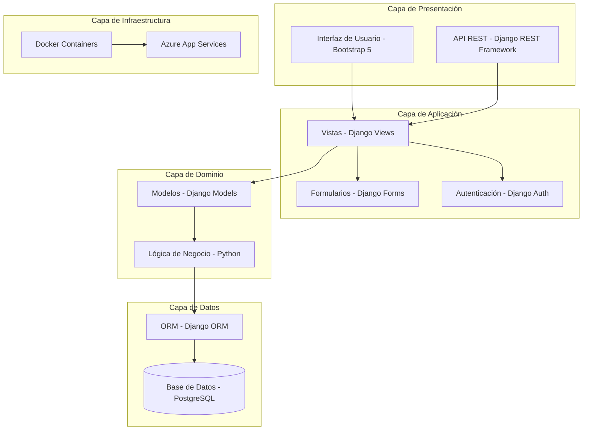
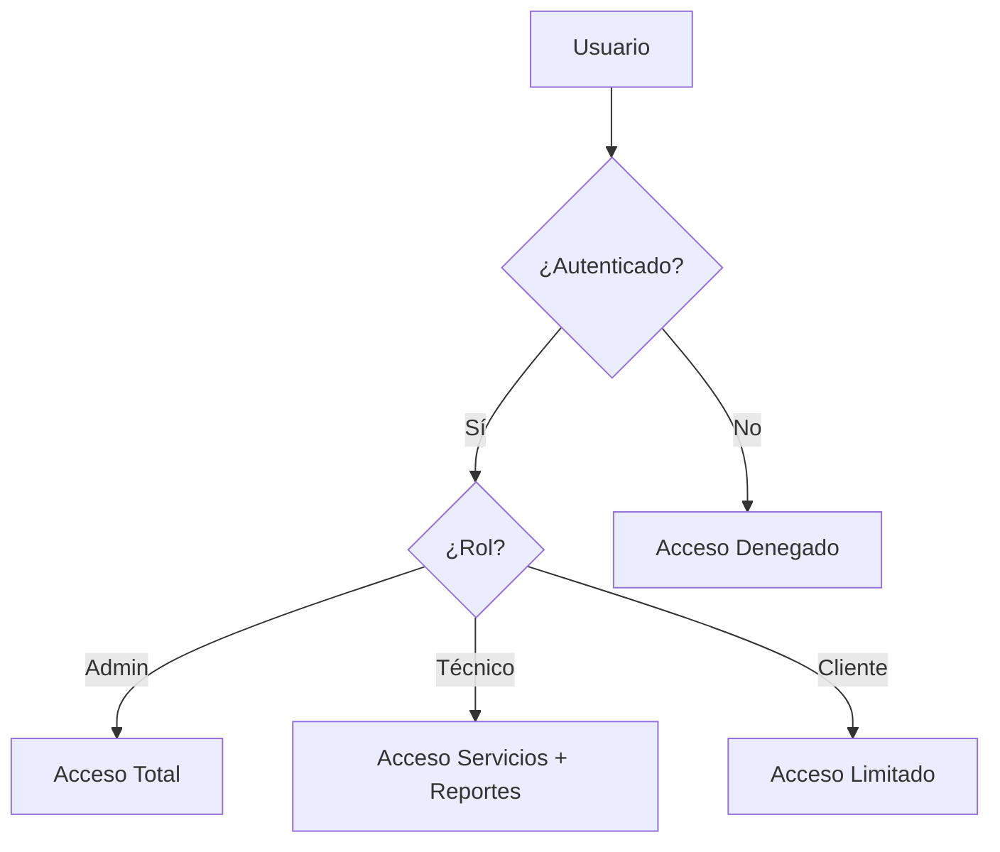
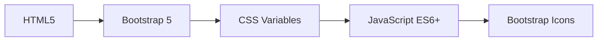

# Arquitectura de Software - Personal Technology

## 📋 Visión General

Personal Technology utiliza una arquitectura **Modelo-Vista-Controlador (MVC)** implementada con Django Framework, siguiendo las mejores prácticas de desarrollo web moderno.

## 🏗️ Arquitectura General



## 🗂️ Estructura de Directorios

```
personal_tech/
├── personal_tech/          # Configuración principal
│   ├── settings.py        # Configuraciones globales
│   ├── urls.py           # Rutas principales
│   ├── views.py          # Vistas base
│   └── wsgi.py           # WSGI para despliegue
├── accounts/              # Gestión de usuarios
│   ├── models.py         # Modelo Profile
│   ├── views.py          # Vistas de autenticación
│   └── signals.py        # Señales para perfiles
├── services/              # Gestión de servicios
│   ├── models.py         # Modelos Client, Service, TechnicalReport
│   ├── views.py          # CRUD operations
│   ├── forms.py          # Formularios Django
│   └── urls.py           # Rutas de la app
├── inventory/             # Control de inventario
├── quotes/               # Sistema de cotizaciones
├── reports/              # Reportes y análisis
├── templates/            # Plantillas HTML
├── static/               # Archivos estáticos
└── docs/                 # Documentación
```

## 🔄 Patrón MVC en Django

### Modelo (Model)
- **Responsabilidades**: Definir estructura de datos, validaciones, relaciones
- **Implementación**: Clases Django Model con campos y métodos
- **Ejemplo**:
```python
class Client(models.Model):
    name = models.CharField(max_length=100)
    email = models.EmailField()
    # ... más campos

    def __str__(self):
        return self.name
```

### Vista (View)
- **Responsabilidades**: Procesar requests, interactuar con modelos, renderizar templates
- **Tipos**: Function-based views, Class-based views
- **Ejemplo**:
```python
def client_list(request):
    clients = Client.objects.all()
    return render(request, 'services/client_list.html', {'clients': clients})
```

### Controlador (Template)
- **Responsabilidades**: Presentar datos al usuario, manejar interacción
- **Tecnología**: HTML con Django Template Language
- **Ejemplo**:
```html

<tr>
    <td>{{ client.name }}</td>
    <td>{{ client.email }}</td>
</tr>

```

## 🔐 Sistema de Autenticación

### Arquitectura de Roles


### Implementación
- **Modelo Profile**: Extensión del User de Django
- **Roles**: admin, technician, client
- **Permisos**: Basados en roles con decoradores @permission_required

## 📊 Arquitectura de Datos

### Patrón Repository
- **ORM Django**: Abstracción de base de datos
- **Querysets**: Consultas optimizadas
- **Migrations**: Control de versiones de esquema

### Relaciones
- **One-to-One**: User ↔ Profile
- **One-to-Many**: Client → Services, Service → TechnicalReports
- **Many-to-Many**: Services ↔ Equipment (a través de relaciones)

## 🌐 Arquitectura Web

### Frontend Architecture


### Componentes Principales
- **Navbar**: Navegación responsive con offcanvas
- **Forms**: Validación client-side y server-side
- **Modals**: Interacciones dinámicas
- **Tables**: Listados con paginación

## 🔧 Arquitectura de Infraestructura

### Desarrollo
- **SQLite**: Base de datos local rápida
- **Django Dev Server**: Servidor de desarrollo
- **Debug Toolbar**: Herramientas de depuración

### Producción
- **PostgreSQL**: Base de datos robusta
- **Gunicorn**: WSGI server
- **Nginx**: Proxy reverso y archivos estáticos
- **Docker**: Contenedorización
- **Azure**: Plataforma cloud

## 📈 Escalabilidad

### Estrategias Implementadas
- **Lazy Loading**: Consultas optimizadas
- **Caching**: Variables de sesión para temas
- **CDN**: Bootstrap desde CDN
- **Database Indexing**: Índices en campos de búsqueda

### Estrategias Futuras
- **Microservicios**: Separación por dominio
- **API Gateway**: Centralización de APIs
- **Load Balancing**: Distribución de carga
- **Database Sharding**: Particionamiento horizontal

## 🔒 Seguridad

### Medidas Implementadas
- **CSRF Protection**: Protección contra ataques CSRF
- **XSS Prevention**: Sanitización de templates
- **SQL Injection**: ORM seguro
- **Authentication**: Sistema robusto de login/logout
- **Authorization**: Control de permisos por roles

### Mejores Prácticas
- **Environment Variables**: Configuraciones sensibles
- **HTTPS**: Comunicación encriptada
- **Input Validation**: Validación en múltiples capas
- **Error Handling**: Manejo seguro de errores

## 📝 Conclusiones

Esta arquitectura proporciona:
- ✅ **Mantenibilidad**: Separación clara de responsabilidades
- ✅ **Escalabilidad**: Diseño modular y extensible
- ✅ **Seguridad**: Múltiples capas de protección
- ✅ **Usabilidad**: Interfaz intuitiva y responsive
- ✅ **Performance**: Optimizaciones implementadas

La arquitectura sigue los principios SOLID, DRY y las mejores prácticas de Django, asegurando un código limpio, mantenible y escalable.